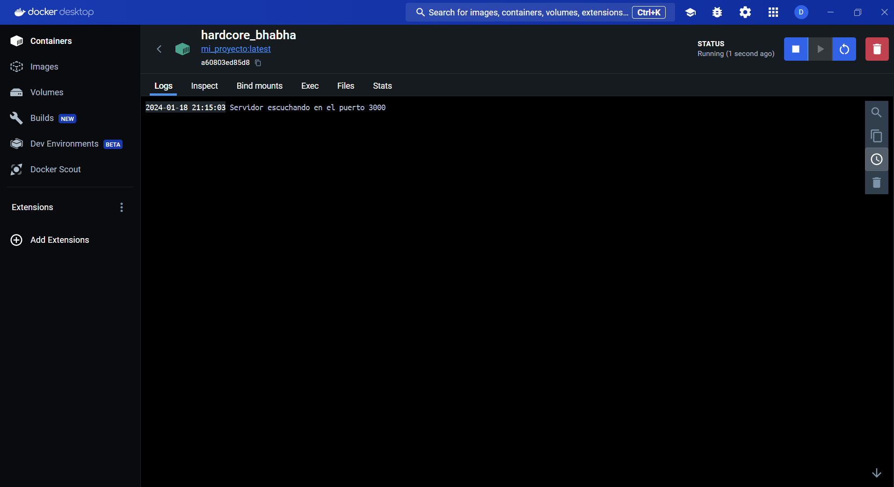
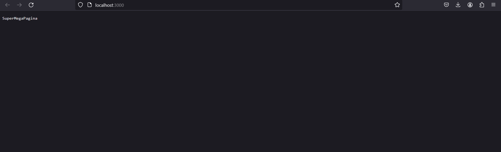

## Table of Contents
1. [General Info](#general-info)
2. [Technologies](#technologies)
3. [Installation](#installation)

### General Info
***
This project demonstrates how to run a Node.js application in a Docker container. It provides a simple HTTP server that responds with a message when accessed.
***
Docker Desktop with the container in progress

Web demostration


## Technologies
***
A list of technologies used within the project:
* [Node]: Version 18
* [JavaScript]
* [MySql2]
* [Docker]

  
## Installation
***
Introduction for installation:  
```
$ git clone https://github.com/SebasChips/practica_docker
$ cd practica_docker/SuperMegaPractica
$ docker compose up
```
## How to use it?
***
To use this useless project there are two options...
You can go to:
1. localhost:3000
2. localhost:3000/time
